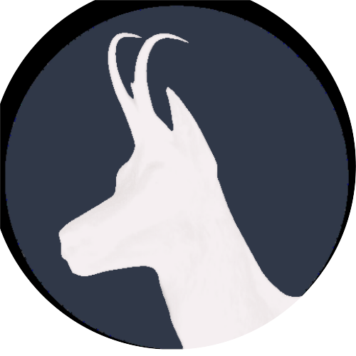

# LifeGoats

A website to introduce an upcoming retreat, to capture its unique characteristics and offerings.

### The challenge:
Create a captivating website that elegantly presents the details of the retreat - date, location and other essential information - providing users with a visually appealing and engaging experience.

### My solution:
A responsive and accessible website that not only highlights the distinctive features of the location but also offers users a sneak peek into the promises and experiences awaiting them at the retreat.


## Website Link

You can visit the live website here:

[Live Website Link](lifegoats.com)


## Logo




## Roadmap

- Redesign the website to establish a sense of community rather than a sole retreat.
- Develop a server to facilitate user authentication, enabling a streamlined process for individuals to secure their spot at future events.


## Installation

This project was bootstrapped with [Create React App](https://github.com/facebook/create-react-app).

Install my-project with npm:

```bash
  npm install my-project
  cd my-project
```


    
## Run Locally

Clone the project:

```bash
  git clone (https://github.com/AnastasiaAdamoudi/LifeGoats)
```

Go to the project directory:

```bash
  cd my-project
```

Go to the client directory:

```bash
  cd client
```

Install dependencies:

```bash
  npm install
```

Start the server to run the client:

```bash
  npm run dev
```

Open [http://localhost:3000](http://localhost:3000) to view it in your browser.


There is a Node.js server connected with the app, to be developed and used in the future.


## Tech Stack

**Design:** Canva, GIMP

**Collaboration:** Trello

**Development:** React.js, React Router, TailwindCSS, Framer Motion, Chart.js, Node.js, Express


